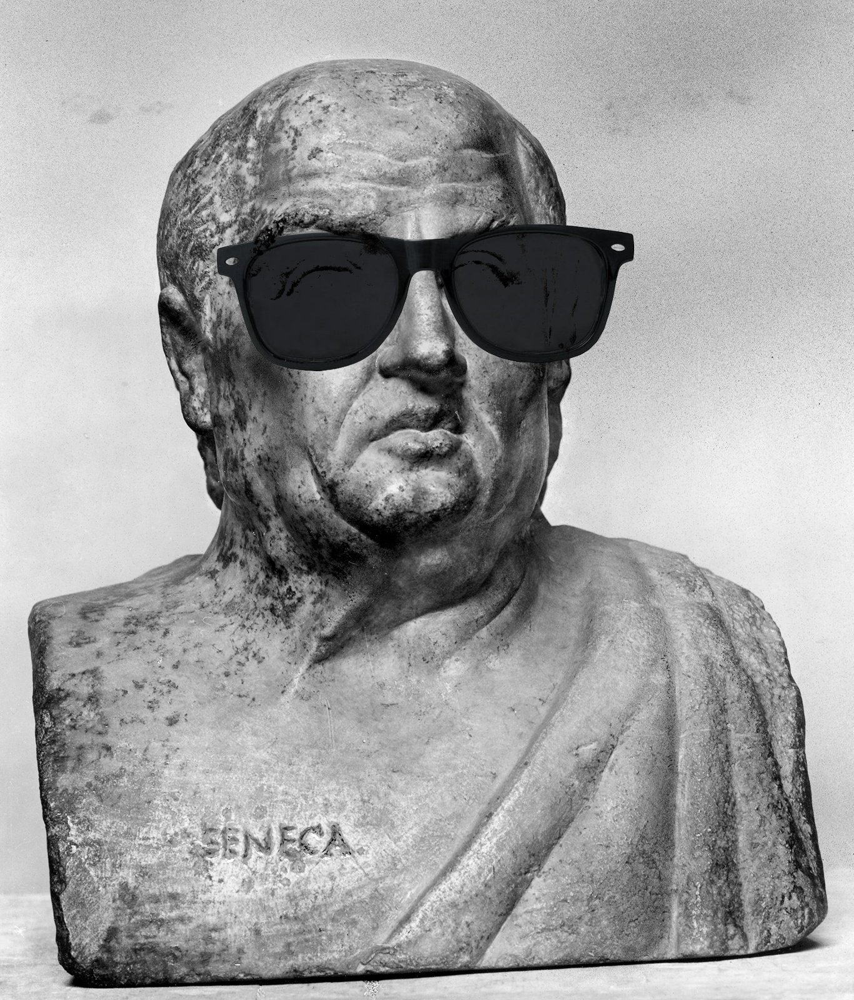

# Seneca

Atomic physics experiments require the repetition of parameterized, hardware-timed sequences. These sequences are typically created, managed, and run using experimental control systems such as the LabScript Suite, Cicero Word Generator, and Artiq. Most common control systems have hardware limitations. Seneca is a new software package to address this issue. Rather than replacing current control systems, Seneca adds a layer of abstraction to the control system paradigm. Seneca use abstract representations of experimental sequences to translate between different control systems and provide unified data analysis tools. Currently, Seneca is only built to interface with Artiq, but it will be expanded to other control softwares in the future.

Seneca is named for Lucius Annaeus Seneca the Elder, a Roman writer and orator.

